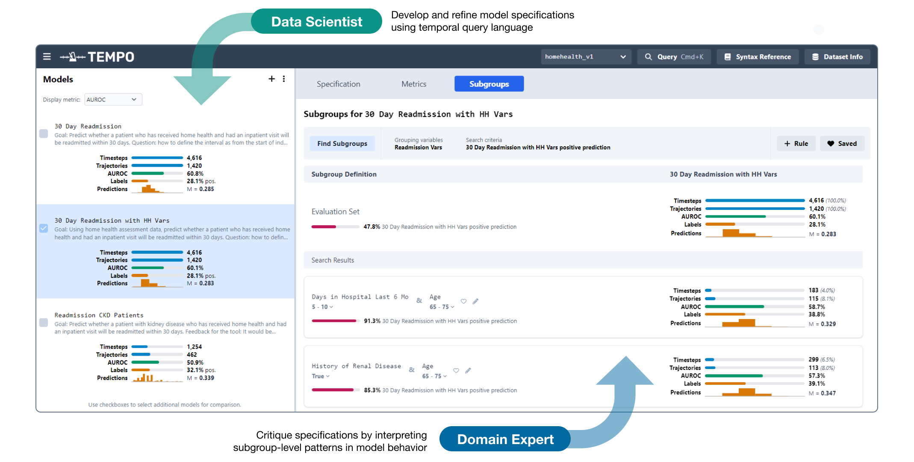

# Tempo: Collaborative Predictive Model Specification

Tempo is an interactive tool to help data scientists and domain experts **define 
specifications for predictive models**. It includes a simple, yet precise query
language for aggregating temporal event data, as well as a built-in subgroup
discovery interface powered by [Divisi](https://github.com/cmudig/divisi-toolkit).



For more information and examples of how Tempo could be used in cross-functional
teams, please see our paper at CHI'25 (link coming soon).

## Setup Instructions

To set up, `cd` into the main repository directory, and run
`pip install -r requirements.txt`. Then `cd` into the `client` directory and run
`npm install && npm run build`.

Create a directory called `datasets` and place any datasets you'd like to load 
within that directory (see below for more details). 

To run the tool, `cd` into the main directory and run:

```bash
python -m tempo_server.server <parent of datasets directory>
```

Then visit `http://127.0.0.1:4999` in your browser to see the tool.

*(Development)* To automatically rebuild the client while changing the source code, 
`cd` into the `client` directory and run `npm run autobuild`. After making changes 
to the source code, you will need to reload the browser page to see the updated version.

## Importing Datasets 

The structure expected for the `datasets` directory is as follows:

```
<parent folder>
- datasets
  - <dataset name>
    - spec.json
    - <data files>
```

Below is an example of the dataset specification (`spec.json`):

```json
{
  "data": {
    "sources": [
      // place data files in the dataset folder (.csv or .arrow) and provide their relative paths here
      { "type": "attributes", "path": "data/attributes.csv" },
      { "type": "events", "path": "data/events.csv" },
      { "type": "intervals", "path": "data/intervals.csv" }
    ]
  },
  "slices": {
    "sampler": {
      // subgroup discovery settings required by Divisi
      "min_items_fraction": 0.02,
      "samples_per_model": 100,
      "max_features": 2,
      "scoring_fraction": 0.5,
      "num_candidates": 20,
      "similarity_threshold": 0.5
    }
  },
  "models": {
    "default": {
      // optionally provide a default model spec
      "variables": {}
    }
  }
}
```

The `datasets` directory in this repo contains an example sourced from an [e-commerce behavior dataset on Kaggle](https://www.kaggle.com/datasets/mkechinov/ecommerce-behavior-data-from-multi-category-store).


## Citation

TBD